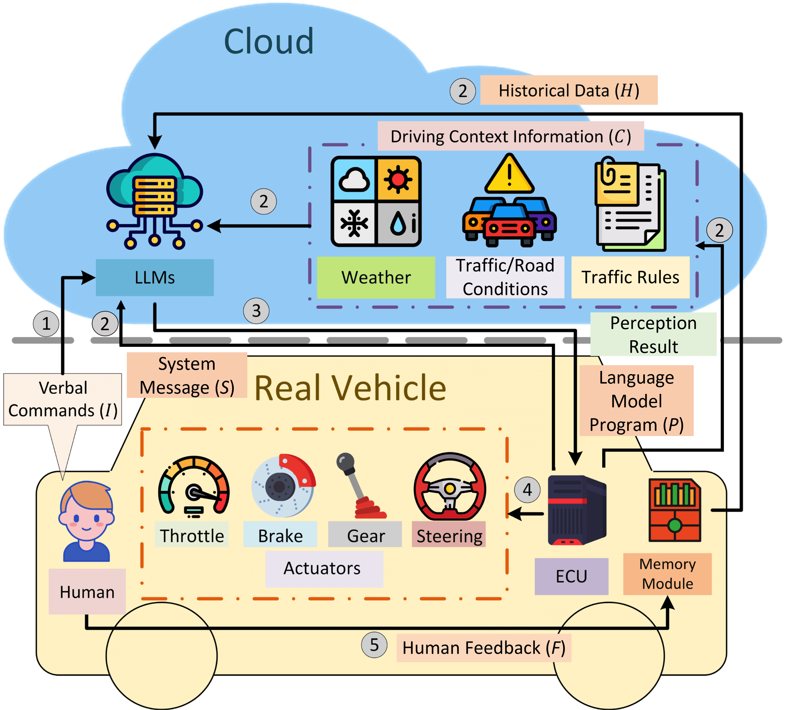

# Personalized Autonomous Driving with Large Language Models: Field Experiments
This repo is the official implementation for [Personalized Autonomous Driving with Large Language Models: Field Experiments](https://arxiv.org/abs/2312.09397). This paper is accepted to [IEEE ITSC 2024](https://ieee-itsc.org/2024/).

<!-- PROJECT ILLUSTRATIONS -->

<br />
<div align="center">
    <p align="center">
        
    </p>
</div>

## About

In this work, we introduce an LLM-based framework, Talk2Drive, capable of translating natural verbal commands into executable controls and learning to satisfy personal preferences for safety, efficiency, and comfort with a proposed memory module. This is the first-of-its-kind multi-scenario field experiment that deploys LLMs on a real-world autonomous vehicle. Experiments showcase that the proposed system can comprehend human intentions at different intuition levels, ranging from direct commands to implicit implications. Additionally, we use the takeover rate to quantify the trust of human drivers in the LLM-based autonomous driving system, where Talk2Drive significantly reduces the takeover rate in highway, intersection, and parking scenarios. We also validate that the proposed memory module considers personalized preferences and further reduces the takeover rate by up to 65.2% compared with those without the memory module. 

## Installation

A Python version of 3.8+ is recommended.

Install dependencies
```
pip install -r requirements.txt
```

You will also need to install PyAudio. For instructions, see https://pypi.org/project/PyAudio/.

[Openai API](https://openai.com/index/openai-api/) key is required. Either put it in `main.py` or set `OPENAI_API_KEY` in your environment variable.

To enable driving context info, [OpenWeather API](https://openweathermap.org/api) and [TomTom API](https://developer.tomtom.com/knowledgebase/platform/articles/how-to-get-an-tomtom-api-key/) keys are required. The API keys should be put into `utils/get_driving_context.py`.

(Optional) The hotword detection feature is implemented using the [EfficientWord-Net](https://github.com/Ant-Brain/EfficientWord-Net) library. You can install it using:
```
pip install EfficientWord-Net
```
A `--no-deps` option is recommended if you encounter errors during the installation. Please refer to the [EfficientWord-Net](https://github.com/Ant-Brain/EfficientWord-Net) repo for installation and few-show hotword training. 

## Usage

To execute specific actions, you need to edit the files in the `scripts/` folder. Sample bash scripts are provided for reference.

For quick start, simply run `python main.py`. For all available options, run  `python main.py -h`.

### Templates

Templates consists of pre-constructed instructions for LLMs and historical interactions between human and LLMs. Some sample templates used in the experiment can be found at the `templates/` folder. You can create your own templates and use them with the `--template_name` and `--memory_path` arguments.

## Citatation

If you find Talk2Drive useful, please consider citing our paper:

```
@article{cui_talk2drive_2024,
  title={Personalized {Autonomous} {Driving} with {Large} {Language} {Models}: {Field} {Experiments}},
  shorttitle = {{Talk2Drive}},
  doi = {10.48550/arXiv.2312.09397},
  journal = {IEEE International Conference on Intelligent Transportation Systems (ITSC)},
  author={Cui, Can and Yang, Zichong and Zhou, Yupeng and Ma, Yunsheng and Lu, Juanwu and Li, Lingxi and Chen, Yaobin and Panchal, Jitesh and Wang, Ziran},
  year={2024},
  url={https://arxiv.org/abs/2312.09397}, 
}
```

## License

This project is distributed under the MIT License. See [`LICENSE`](LICENSE) for more information.

## Acknowledgement

This project draws inspiration from the following open-source projects and resources:

- [Autoware-AI](https://github.com/autowarefoundation/autoware/tree/autoware-ai)
- [EfficientWord-Net](https://github.com/Ant-Brain/EfficientWord-Net)
